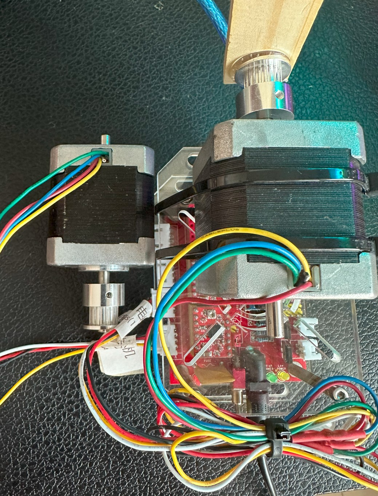
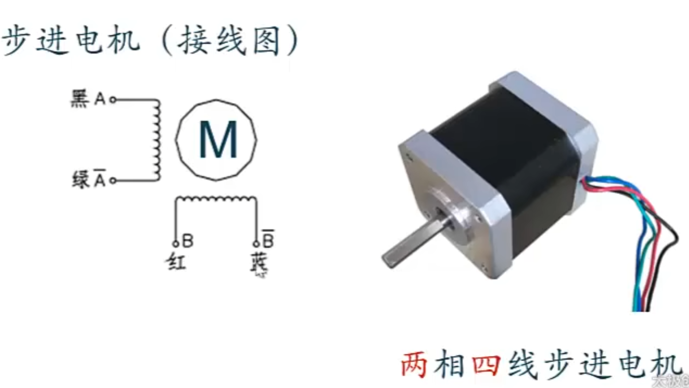

## 控制板
- 主控：`Arduino Nano ATMega328P`，驱动：[A4988](https://item.taobao.com/item.htm?spm=a21n57.1.item.3.1fdb523cUqgPED&priceTId=2147809417186155800711217e39c8&id=611515767013&ns=1&abbucket=11)，电机：[NEMA双极性步进电机（42步进电机）](http://www.taichi-maker.com/homepage/reference-index/motor-reference-index/nema-stepper-motor/)。原来是激光切割机，烧录了`Grbl 0.8c`，在github上有代码：[grbl v0.8](https://github.com/grbl/grbl/tree/v0_8)
- 因此挥动气球针可以直接发送`gcode`来控制

## 串口命令
串口波特率为`9600`

`G1 Y0 F6000`: 控制Y轴步进电机到0坐标，F6000表示速度

`G1 Y-10 F6000`: 控制Y轴步进电机到-10坐标

`G1 Y0 F6000`:  控制Y轴步进电机到0坐标

`G91`: 设置为相对位置模式

`G1 X100 F1000`: 控制 X 轴电机前进

`G90`: 返回到绝对位置模式

## 使用
1. 进入dycast开源项目：`cd dycast`
2. 下载依赖：`npm install`
3. 运行弹幕转发程序：`npm run dev`
4. 运行弹幕游戏逻辑代码：`python main.py`
5. 浏览器打开[http://localhost:5173/](http://localhost:5173/)，输入房间号，房间号在web端dy地址栏中可以获取[https://live.douyin.com/49910668388](https://live.douyin.com/49910668388)，其中`49910668388`就是房间号，进行连接
6. 在打开的[http://localhost:5173/](http://localhost:5173/)中输入转发地址，第4步的时候会在终端中显示：`ws://localhost:8765`